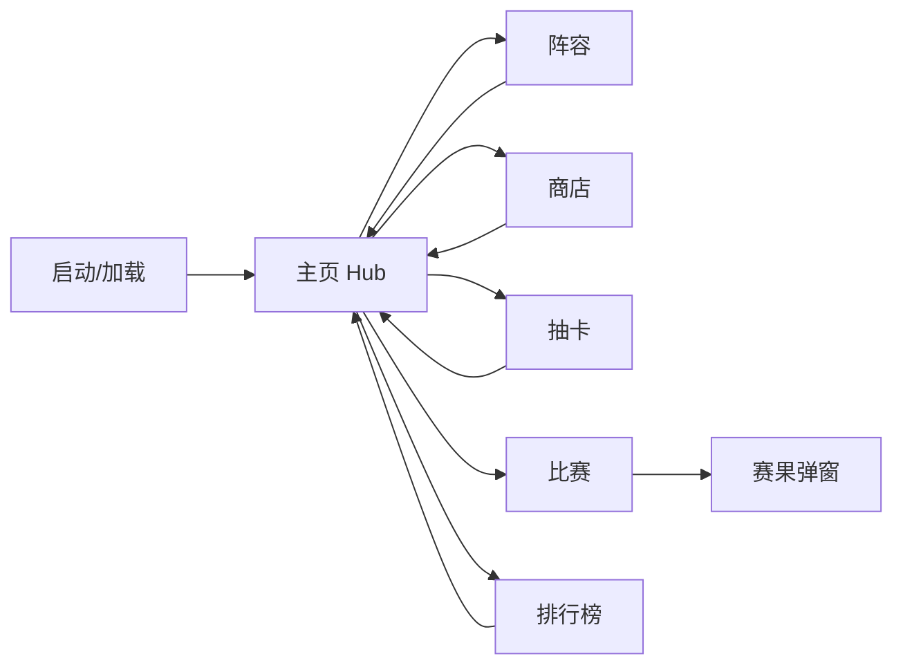

# 足球经理抖音小游戏 · MVP 设计稿

面向 **Cocos Creator 3.x** + **抖音小游戏** 的首个可玩版本。仅文字与几何 UI，无真实球星肖像与商标。

---

## 1. 产品目标（MVP）

| 模块 | MVP 行为 |
|------|-----------|
| 经理 | 输入昵称，本地存档 |
| 阵容 | 选择阵型，将已有球员拖入 11 人槽位（位置不匹配有小幅惩罚） |
| 买人 | 商店刷新 6 名「挂牌球员」，用金币购买 |
| 抽卡 | 单抽消耗金币，按稀有度权重出卡 |
| AI 对战 | 与预设强度的 AI 踢一场，影响积分与金币 |
| 排行榜 | 本地榜：本机经理积分 + 若干虚拟 NPC（后续可接抖音开放数据域） |
| 身价 | 每名模板球员带「参考身价（百万欧量级）」虚构数值，与世界大赛热门位置/强度档位对齐量级，**非真实球员** |

---

## 2. 信息架构与界面流



---

## 3. 屏幕清单与线框（文字线框）

### 3.1 主页 Hub

- 顶栏：金币、积分（用于榜）、经理昵称（可点改）
- 中部大按钮：**比赛**（主 CTA）
- 底部四 Tab：**阵容 | 商店 | 抽卡 | 排行**

```
┌─────────────────────────────┐
│ 昵称 ▾    金币 12,800  积分 320 │
├─────────────────────────────┤
│                             │
│     ┌─────────────────┐   │
│     │   开始 AI 对战   │   │
│     └─────────────────┘   │
│   [简单] [普通] [困难]      │
│                             │
├─────────────────────────────┤
│ 阵容    商店    抽卡    排行 │
└─────────────────────────────┘
```

### 3.2 阵容

- 上：阵型选择（4-4-2 / 4-3-3 / 3-5-2） segmented
- 中：球场示意 11 槽位（圆圈+位置缩写）
- 下：替补/仓库列表（ScrollView，仅名字、位置、总评、身价）

### 3.3 商店

- 「刷新挂牌」按钮（消耗少量金币）
- 6 张卡片：名字、位置、总评、身价、购买价、购买按钮

### 3.4 抽卡

- 中央卡背 + 「单抽（500 金币）」
- 下方最近 5 条抽卡记录（名字+稀有度颜色）

### 3.5 比赛

- 选难度后开始 → 全屏进度条「模拟中…」0.8–1.2s
- 赛果：比分、预期进球 xG 风格一行字、金币/积分变化

### 3.6 排行榜

- ScrollView：名次、昵称、积分、胜场
- 本机条目高亮

---

## 4. 视觉规范（MVP）

| Token | 值 | 用途 |
|-------|-----|------|
| 背景主色 | `#0B1D2A` 深蓝绿 | 全屏底 |
| 卡片/面板 | `#132F3F` 85% 不透明 | 列表项 |
| 主强调 | `#2ECC71` 草绿 | 主按钮、胜利 |
| 警告/稀有 S | `#F1C40F` | S 卡、金币强调 |
| 稀有 A | `#9B59B6` | A 卡 |
| 稀有 B | `#3498DB` | B 卡 |
| 稀有 C | `#95A5A6` | C 卡 |
| 正文 | `#ECF0F1` | 主文字 |
| 字体 | 系统无衬线；标题 32–36sp，正文 24–28sp（按抖音安全区适配） |

圆角：卡片 12px，主按钮全圆角胶囊。图标 MVP 可用简单矢量球/盾牌占位。

---

## 5. 核心数值（与代码一致）

- 初始金币：`10000`
- 单抽：`500` 金币
- 商店刷新：`200` 金币
- 比赛奖励（胜/平/负）：简单 `+350/+120/-80`，普通 `+500/+180/-100`，困难 `+800/+260/-120`（可再调）
- AI 基准：简单场均总评约 62、普通 72、困难 82（由引擎生成虚拟对手）

---

## 6. 抖音小游戏接入说明（后续）

- 存档：MVP 使用 `tt.setStorageSync` / `tt.getStorageSync`（本仓库 `StorageAdapter` 已预留）；浏览器开发 fallback 为 `localStorage`。
- 排行榜：正式上线需 **开放数据域** + 子域 Canvas；当前本地榜用于玩法验证。
- 构建：在 Cocos Creator 中安装字节跳动小游戏发布模板，将本目录 `assets/scripts/football-mvp` 拷入工程 `assets` 后绑定 UI 事件到 `FootballMvpBridge` 组件。

---

## 7. 版权说明

球员均为 **虚构姓名** 与 **虚构身价**，不与真实个人一一对应；无头像、无队徽、无联赛官方标识，降低侵权风险。后续若接入真实数据需单独取得授权。
